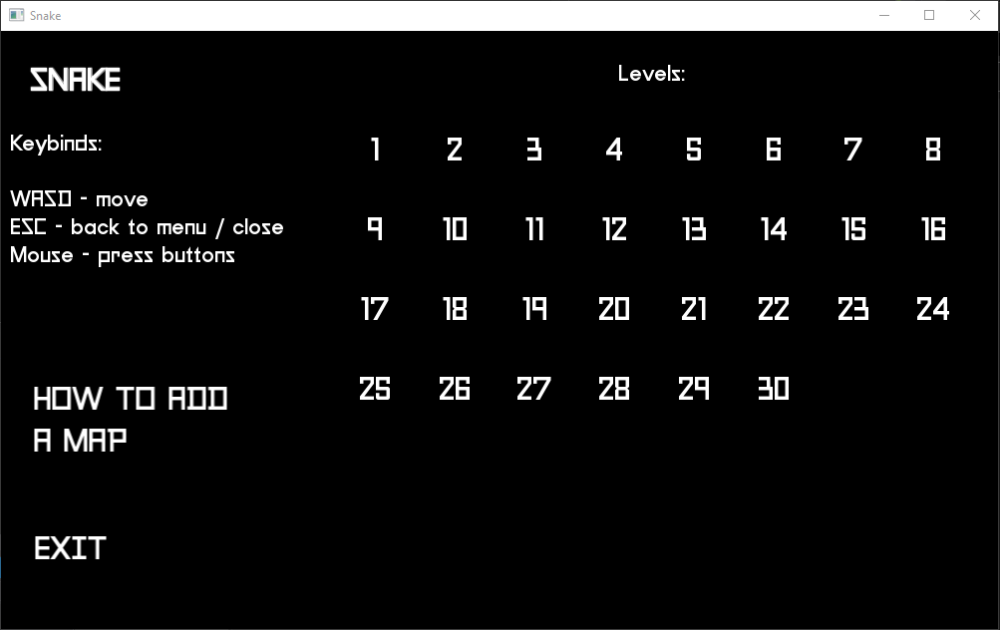
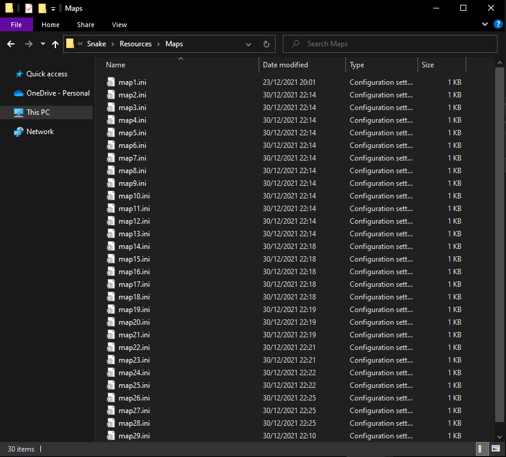
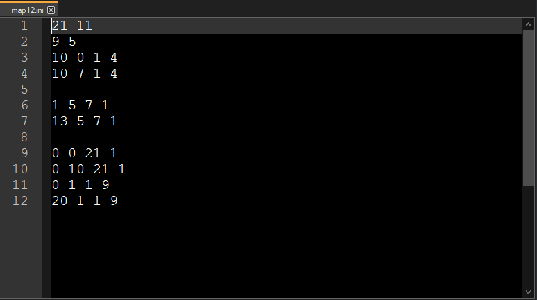
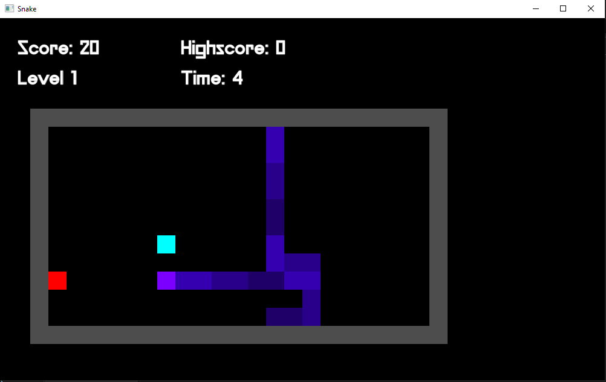
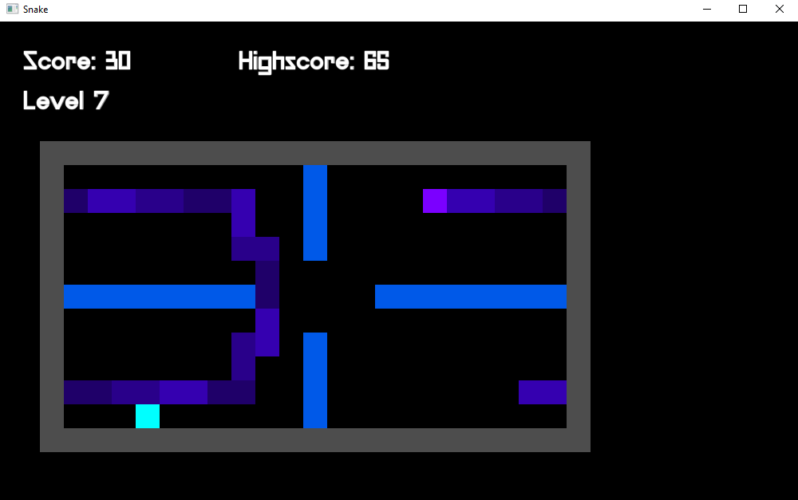
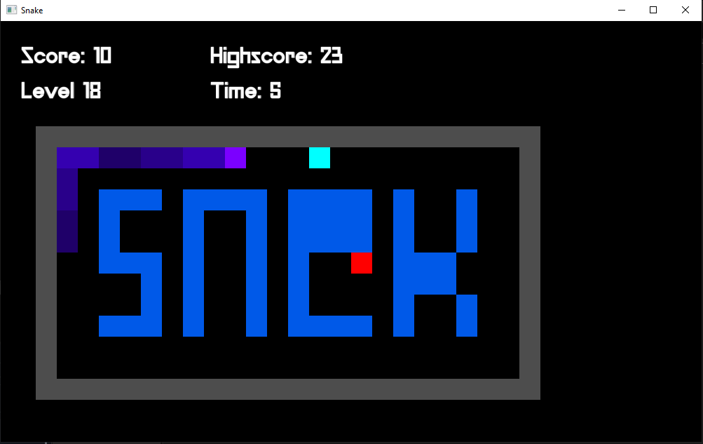

<!-- PROJECT TITLE -->

  <h1 align="left">Snake</h1>

<!-- ABOUT THE PROJECT -->
## About The Project

The classical Snake, implemented using C++ and SFML.

It comes with:
* 30 levels, each with a different map
* the possibility to create custom levels and integrate them into the game
* a purple snake

<!-- Download -->
## Download
Get the .zip [here](https://github.com/teo3fl/Snake/releases)

<!-- USAGE EXAMPLES -->
## Usage

Select a level from the menu by clicking on its corresponding number. 
 
Keybinds:
* WASD - move
* ESC - back to menu / close
 

 
 

### Adding maps
You can add a map by adding a file with the name map(level number).ini in <i>Resources/Maps</i>. 
 
 
 
 
The structure of a map_.ini file can be broken down as such:
* the first line contains the <b><i>width and height of the map</i></b>
* the second line contains the X and Y coordinates of the <b><i>initial player position</i></b>
* any line that follows will contain the <b><i>positioning and size of a wall</i></b>: the first 2 numbers indicate the X and Y position of the <b><i>upper left corner</i></b>, then the following 2 numbers indicate the <b><i>width and heigth of the wall</i></b>

<i>The coordinates and sizes are <b>integers</b> and represent the <b>number of tiles</b>, not pixels.</i> 
 
 

(<a href="#top">back to top</a>)

<!-- LEVELS -->
## Levels

The game comes with 30 levels, and can support up to 48 maps in total. 
 
 
 
 
 
 

(<a href="#top">back to top</a>)

